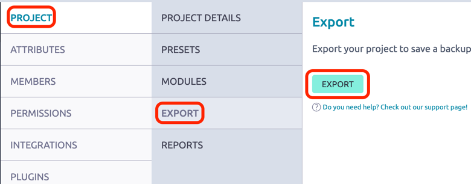
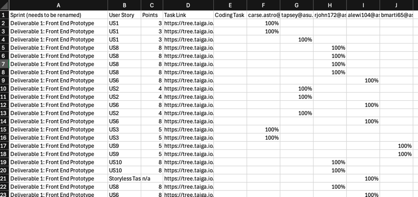

# SERCapstoneWorkSum

### What is it? 
An automated python tool that will generate your semester work report for you.

### How do I make it work?  
1. Export your project data from taiga 
  - Under Settings select export and put that json file in the same dir as taiga-parser.py
  - 
2. Run the file.
  - `python taiga-parser.py` will seek out the 1st .json in the current directory and try to extract the project data from it  
  - Or `python taiga-parser.py <taiga export filename>` will direct the program to a specific file.
3. Copy the data from `draft_work_report.csv` into your Semester Work Summary.
  - 
4. Rename the Sprint Column data. Taiga identifies sprints by their name, not by their number
  - This can most easily be done with a find and replace in Excel  
5. Manually input if each task was a coding task or not. That information is not stored in Taiga.

### Do I need to install any libraries to make this work?

This program only uses built-in libraries. No need to install anything beyond basic python.